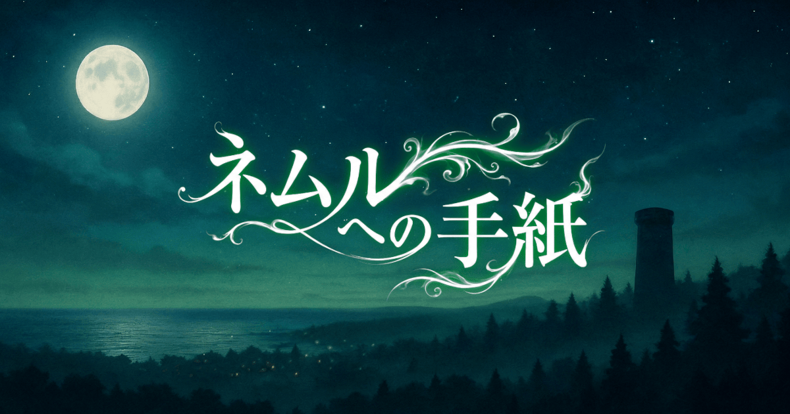
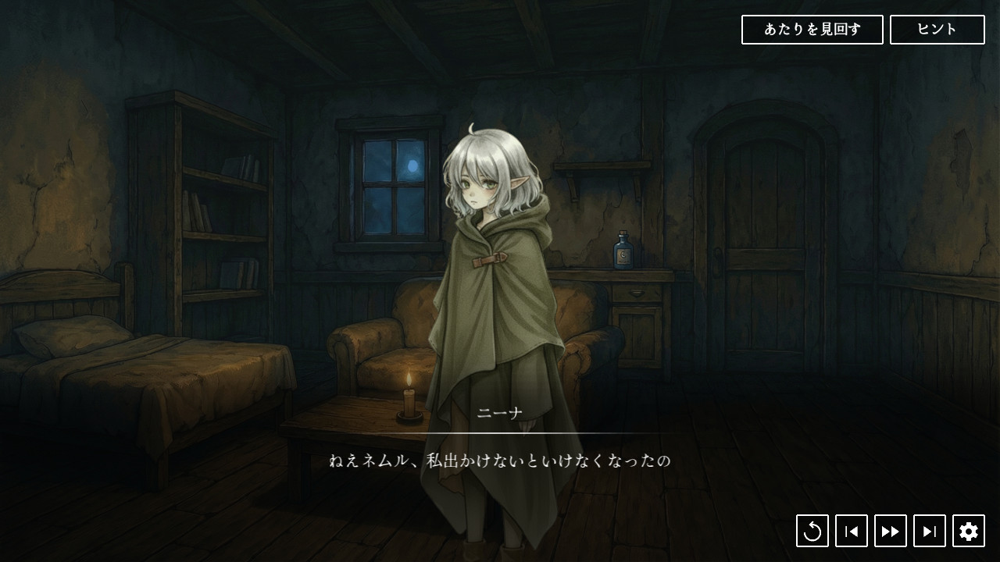

Vueを用いたゲーム開発ライブラリ [Phavuer](https://github.com/laineus/phavuer) で作られた短編ADVです。

- [公式サイト](https://neml.laineus.com/)
- [Steam](https://store.steampowered.com/app/4311740/_/)

# ネムルへの手紙 - Letter to Neml





悪夢を見ると現実になってしまう種族《ノクタリアン》の物語。

ひとり留守番をする少女ネムルの小さな選択が世界の運命を変えていく。

＊

プレイヤーができることはたったひとつ。**ネムルに送る手紙の内容を書き換えることだけ。**

手紙の内容をAIが判定し、ネムルの行動と物語の結末が変化していく。

# Development

Requirements: Node.js, Gemini APIキー

```
letter-to-neml/        # ゲーム本体
├─ server/           # 生成AIによる手紙解析APIサーバー
├─ story-editor/     # シナリオ編集ツール
└─ electron/         # Steam向けネイティブビルド
```

# Licence

ソースコードはMITライセンスで自由に利用可能です。

グラフィック、サウンド、シナリオなどのアセットの利用は含まれません。
